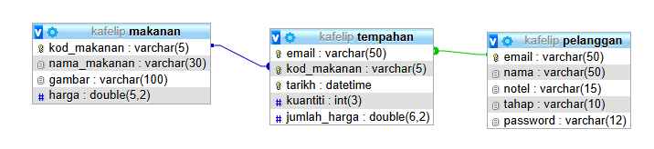
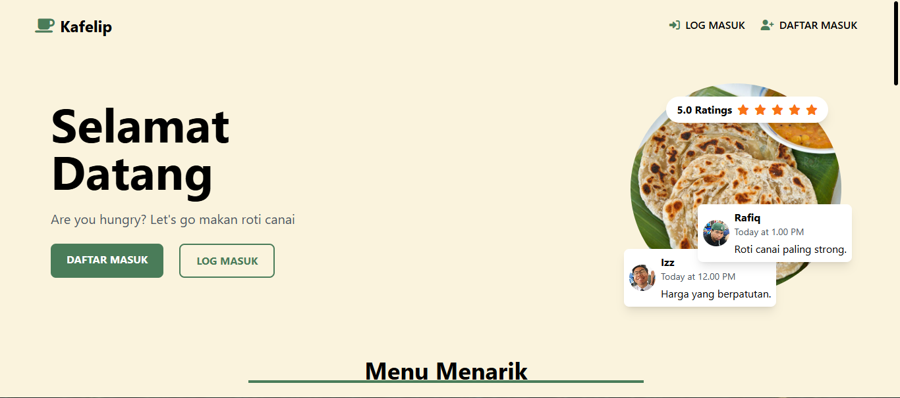
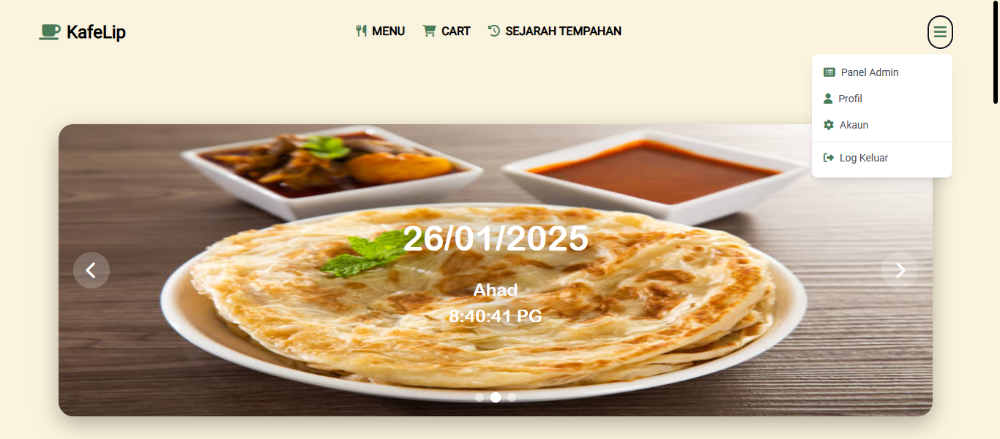
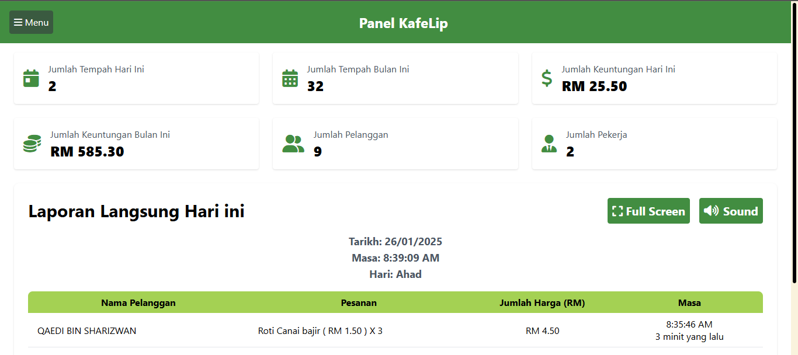

  <a href="#">

&nbsp;&nbsp;

* ## Version ⚙️
AppServ Open Project - 9.3.0 for Windows

PHP 7.3.10

phpMyAdmin Database Manager Version 4.9.1

Apache Web Server Version 2.4.41

PHP Script Language Version 7.3.10

MySQL Database Version 8.0.17

* ## SETUP DATABASE ⚙️
 Edit user and password database kat fail <a href="https://github.com/AlipBot/KafeLip/blob/main/function/connection.php">connection.php</a>
 ### JADUAL ERD

import sql <a href="lib/readme/kafelip.sql">kafelip.sql</a>

* ## Screenshot
  
  
  

* ## Senarai Ciri - Ciri 💡

| Ciri - Ciri Sistem Umum |🌱|
| ------------- | ------------- |
| SweetAlert2  |✔️|
| Sound Alert |✔️|
| Auto Padam Fail Gambar Menu |✔️|
| Auto Log Out Sistem Admin or User |✔️|
  
| Ciri - Ciri Sistem Akaun |🌱|
| ------------- | ------------- |
| Log Masuk |✔️|
| Daftar Masuk |✔️|
| Email dan No.Tel Log Masuk |✔️|
| Simpan Data Login  |✔️|
| Tukar Kata Laluan |✔️|
| Tukar Email  |✔️|
| Tukar Nama |✔️|
| Tukar No.Tel |✔️|
| Padam Akaun |✔️|

  

| Ciri - Ciri Sistem Tempahan Pengguna |🌱|
| ------------- | ------------- |
| Cart |✔️|
| Menu |✔️|
| Sejarah Tempahan  |✔️|
| Batal Tempahan |✔️|
| Resit  |✔️|
| Semak Resit |✔️|
| Kuantiti Makanan  |✔️|
| Profil |✔️|
| Akaun  |✔️|

| Ciri - Ciri Sistem Tempahan Admin |🌱|
| ------------- | ------------- |
| Panel Admin |✔️|
| Laporan Tempahan Makanan Secara Langsung |✔️|
| Sound Alert  |✔️|
| Senarai Pengguna |✔️|
| Senarai Makanan  |✔️|
| Sejarah Laporan |✔️|
| Statistik  |✔️|
| Langsung Data Kemaskini Graf |✔️|

